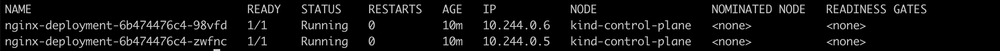

# Overview
This yaml can be used to install the kubernetes dashboard onto Kind or Minikube. 

# Prequesite
You have a kubernetes cluster configured and are using the proper context with `kubectl`. 

# Process

1. Install `kind` by running `brew install kind`. 
2. Create cluster by running `kind create cluster`. 
3. Check kubernetes config by running `kubectl get nodes -o wide`. You should see some output like this: 

4. Now let's apply the Dashboard. Run `kubectl apply -f https://raw.githubusercontent.com/kubernetes/dashboard/v2.0.0-beta8/aio/deploy/recommended.yaml`
5. Run `kubectl apply -f dashboard-adminuser.yaml`
6. Run `kubectl apply -f clusterrolebinding.yaml`
7. Run `kubectl proxy`
8. Run `kubectl -n kubernetes-dashboard describe secret $(kubectl -n kubernetes-dashboard get secret | grep admin-user | awk '{print $1}')`
9.  Copy the token from the output. 
10. Go to http://localhost:8001/api/v1/namespaces/kubernetes-dashboard/services/https:kubernetes-dashboard:/proxy/
11. Select the `token` option to log in and paste the token you copied into the field. 
12. Hit sign in button and boom you're into the dashboard. 

# Deployment
For fun let's just deploy nginx to our cluster:
1. Run `kubectl apply -f https://k8s.io/examples/application/deployment.yaml`. 
2. Run `kubectl get pods -o wide`. You should see something like this: 
   
3. Now let's expose our nging deployment. Run `kubectl expose deployment nginx-deployment --type NodePort`. 
4. Through port forwarding we can access our application. First run `kubectl get svc`. You should see this: 
   
Now run `kubectl port-forward service/nginx-deployment 8000:80`. 
(Assuming nothing else is running on port 8000)
5. In your browser, go to http://localhost:8000. 
   You should see the default nginx page. 

# Clean up
You can honeslty just run `kind delete cluster` and it'll delete the default cluster by the name of `kind`. If you gave your cluster a name just run `kind delete cluster --name <name of cluster>`. 

Enjoy!

